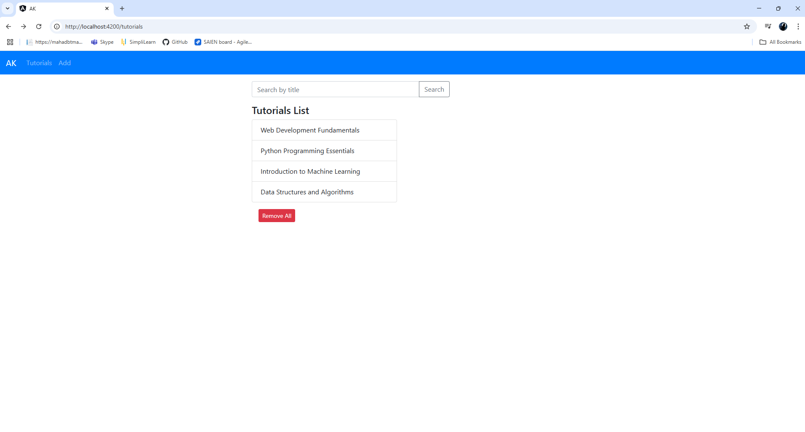
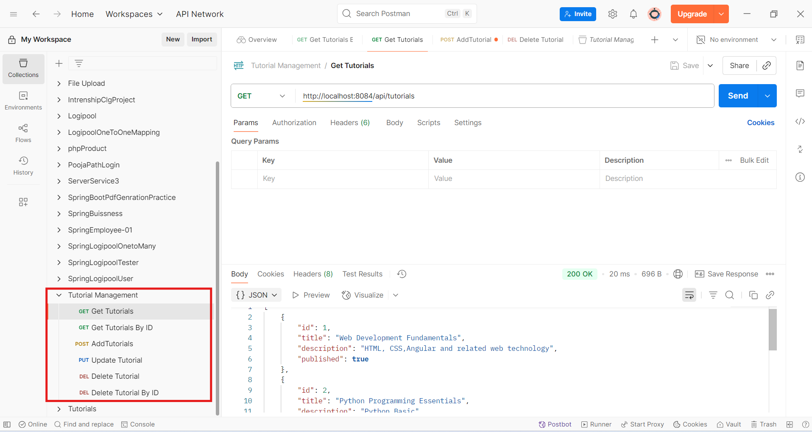

# 📚 Tutorial-Management-Project

A full-stack Angular + Spring Boot project for managing tutorials with MySQL and REST APIs.

---

## 🚀 Tech Stack

| Layer     | Technology                  |
|-----------|-----------------------------|
| Frontend  | Angular                     |
| Backend   | Spring Boot (Java)          |
| Database  | MySQL                       |
| API Test  | Postman                     |
| Tools     | Maven, Git, GitHub          |

---
## ✨ Features

- 🔍 List all tutorials
- ➕ Add new tutorials
- 📝 Update existing tutorials
- ❌ Delete individual or all tutorials
- 🔎 Search tutorials by title

---

## 📁 Folder Structure

```plaintext
Tutorial-Management-Project/
├── Backend/         # Spring Boot backend
├── Frontend/        # Angular frontend
├── Database/        # SQL scripts or DB config
├── images/          # Screenshots, structure diagrams
├── .metadata/       # IDE metadata (optional to include)
├── README.md
└── Tutorial Management.postman_collection.json
```

---

## ⚙️ How to Run the Project

### 🖥️ Clone the Repository

```bash
git clone https://github.com/aditikalamkar/Tutorial-Management-Project.git
cd Tutorial-Management-Project
```

---

### 🔧 Backend Setup (Spring Boot)

```bash
cd Backend
# Update application.properties with your MySQL config
mvn clean install
mvn spring-boot:run
```

---

### 🌐 Frontend Setup (Angular)

```bash
cd ../Frontend
npm install
ng serve
```

App will run on `http://localhost:4200/`

---

### 🛢️ MySQL Setup

1. Create DB in MySQL:

```sql
CREATE DATABASE <YourDbName>;
```

2. Update credentials in `application.properties`:

```properties
spring.datasource.url=jdbc:mysql://localhost:3306/YourDbName
spring.datasource.username=yourUsername
spring.datasource.password=yourpassword
```

---

## 📮 Postman Collection

🧪 You can find the API test collection here:  
[`Tutorial Management.postman_collection.json`](Tutorial%20Management.postman_collection.json)

---

## 📸 Screenshots

| Page | Screenshot |
|------|------------|
| Home |  |
| API Test |  |


---

### 🎉 Happy Learning & Full-Stack Building!
